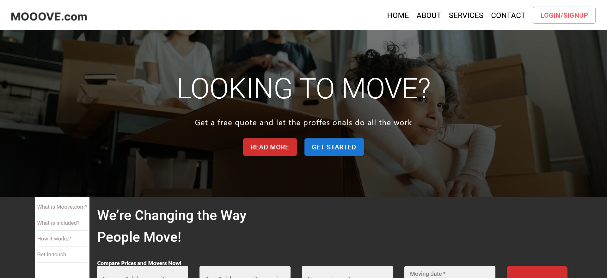

# Movers

  - Clone the repo at 
  - Open the project folder in your favorite text editor (VSCode recommend)
  - Run `npm install` to install dependencies
  - Run `npm start` to start the development server
  - The server should start running on port 3000: http://localhost:3000
###

Runs the app in the development mode.\
Open [http://localhost:3000](http://localhost:3000) to view it in your browser.

The page will reload when you make changes.\
You may also see any lint errors in the console.

### `npm test`

Launches the test runner in the interactive watch mode.\
See the section about [running tests](https://facebook.github.io/create-react-app/docs/running-tests) for more information.

<!-- https://www.bigdatacloud.com/docs/api/free-reverse-geocode-to-city-api -->
